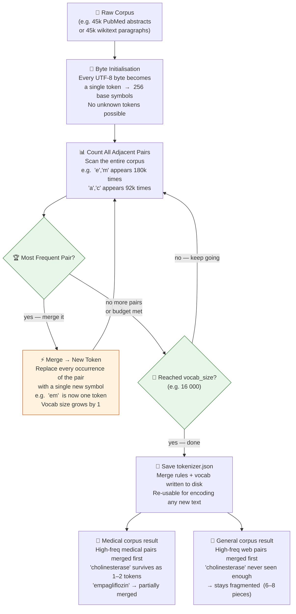

# 🔬 How Byte-Level BPE Training Works

> **The core idea:** BPE is a greedy frequency algorithm. It finds the most common pair of adjacent
> symbols and merges them. Run it on medical text and medical morphemes win. Run it on the web
> and medical terms stay fragmented.

This page is the visual version of the training process.

If you are new to BPE, the simplest way to read the diagram is from top to bottom:

1. start with raw text
2. break it into byte-level symbols
3. count which adjacent pairs appear most often
4. merge the most frequent pair into a new token
5. repeat until the vocabulary budget is used up

The important idea is that BPE does not understand medicine, chemistry, or grammar. It only follows frequency.

## How to read the loop

The center of the diagram is the repeated training loop:

- count all adjacent symbol pairs in the corpus
- find the most frequent pair
- merge that pair into a new token
- count again on the updated corpus

This repeats thousands of times. Each merge adds one new vocabulary entry.

So when the vocabulary size is 16k, the tokenizer is really getting a fixed merge budget. The question is where that budget gets spent.

## 🔑 Key insight

The algorithm is identical for medical and general corpora.
The **only** difference is which pairs appear most often in the training text.

| Step | Medical corpus (PubMed) | General corpus (wikitext) |
|------|------------------------|--------------------------|
| Most frequent pairs | `ch`→`o`→`li`→`ne`→`ster`→`ase` (clinical chemistry) | `th`→`e`, `in`→`g`, common web morphemes |
| After 16k merges | `cholinesterase` = 1 token | `cholinesterase` = 6–8 fragments |
| Fertility on PubMed held-out | **1.381** (winner) | 1.747 (worst) |

> This is why `general-bpe` (same 16k vocab, same algorithm, general corpus) scores **worse** than
> `custom-med` on medical text — it spent its merge budget on the wrong frequency distribution.

In plain language: same algorithm, same vocabulary size, different training text. That is enough to create very different tokenizers.

That is the main lesson of the whole lab.

---
*Back to theory: [03 custom domain tokenizers](../theory/03-custom-domain-tokenizers.md)*
