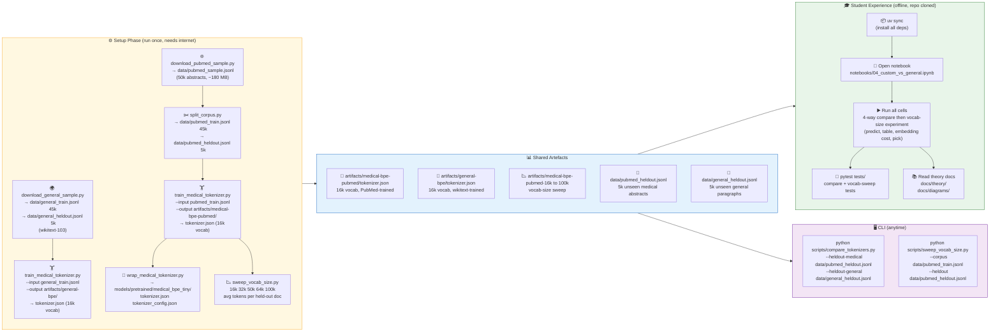

# 🗺️ Full Lab Pipeline

> **Two tracks, one destination:** The data and models are built once in the setup phase.
> Then the notebook is opened and everything prepared is explored.

This page shows the whole lab from raw data to final comparison.

If you want the short version, read the diagram in three parts:

1. **setup** builds the datasets and tokenizers
2. **shared artifacts** store the files produced by setup
3. **lab usage** explores those artifacts in the notebook, CLI, and tests

## Complete pipeline flowchart

## How to read this pipeline

The left side is the preparation phase. This is where corpora are downloaded, split, and used to train tokenizers.

The center is the shared output of that preparation:

- held-out datasets for fair evaluation
- trained tokenizers for medical and general text
- optional vocab-size sweep artifacts

The right side is how those outputs get used:

- the notebook for the main learning experience
- CLI scripts for quick comparisons
- tests for numerical verification

So the notebook is not doing everything from scratch. It is consuming artifacts that were prepared earlier.

## Why the split into phases matters

The setup phase needs more time and may need internet access. The notebook phase is the teaching and exploration phase.

That separation is useful because it lets the lab work in two modes:

- **full pipeline mode**: download data, train tokenizers, run the whole experiment
- **offline learning mode**: reuse prepared artifacts and focus on understanding the results

This is why the repo includes fallback files such as `models/pretrained/medical_bpe_tiny/`.

## Script quick reference

| Script | When | Input | Output |
|--------|------|-------|--------|
| `download_pubmed_sample.py` | Setup | HuggingFace Hub | `data/pubmed_sample.jsonl` |
| `split_corpus.py` | Setup | pubmed_sample.jsonl | train + heldout splits |
| `download_general_sample.py` | Setup | HuggingFace Hub | general train + heldout |
| `train_medical_tokenizer.py` | Setup (×2) | any `.jsonl` corpus | `tokenizer.json` (BPE) |
| `wrap_medical_tokenizer.py` | Setup | tokenizer.json | HuggingFace-compatible model |
| `compare_tokenizers.py` | Lab | heldout files | Fertility table (terminal) |
| `sweep_vocab_size.py` | Lab | pubmed train + heldout | 16k–100k avg tokens/doc table |
| `pytest tests/` | Lab | held-out files | compare + vocab-sweep asserts |

## Main takeaway

The pipeline is designed so that each stage answers one question:

- data preparation makes the train and held-out split fair
- tokenizer training asks what the corpus teaches the vocabulary
- comparison asks which tokenizer is best on held-out text
- vocab sweep asks how large the medical vocabulary should be
- tests check that the main claims are reproducible

In plain language: this is not just a notebook with nice plots. It is a small end-to-end experiment.

---
*Back to theory: [00 overview](../theory/00-overview.md)*
