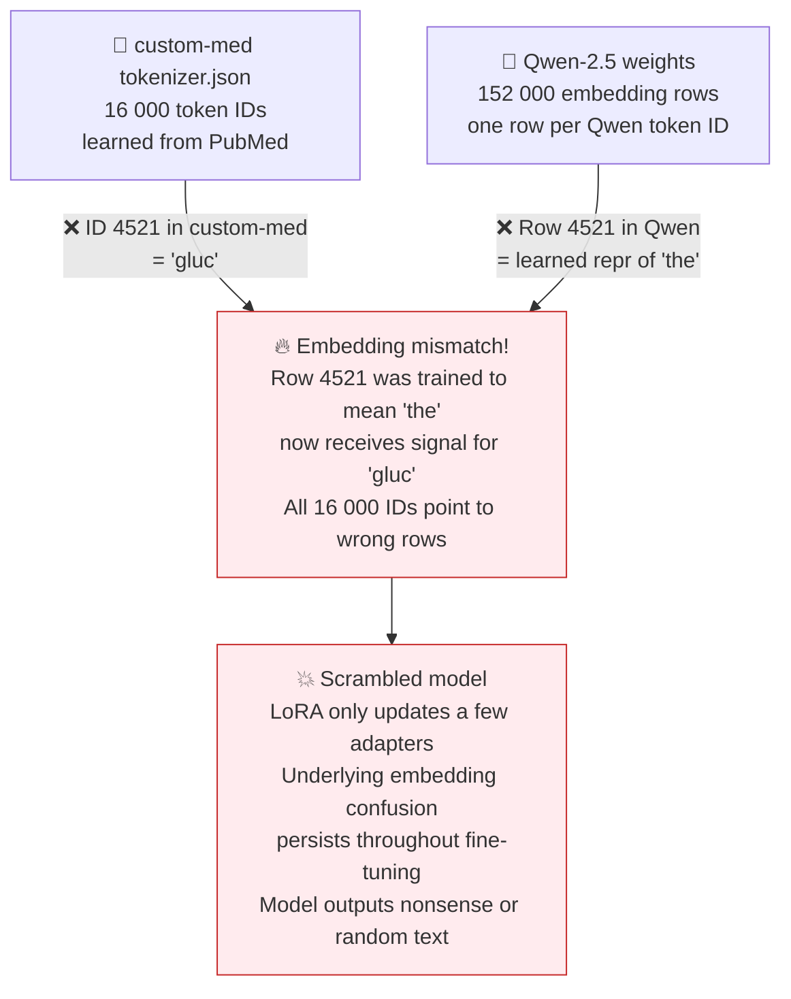
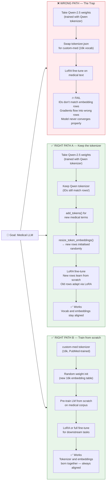
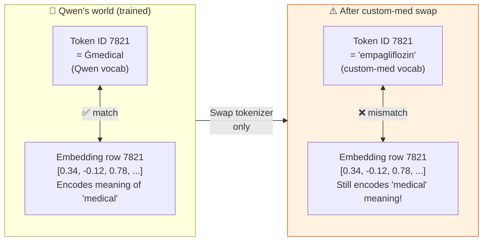
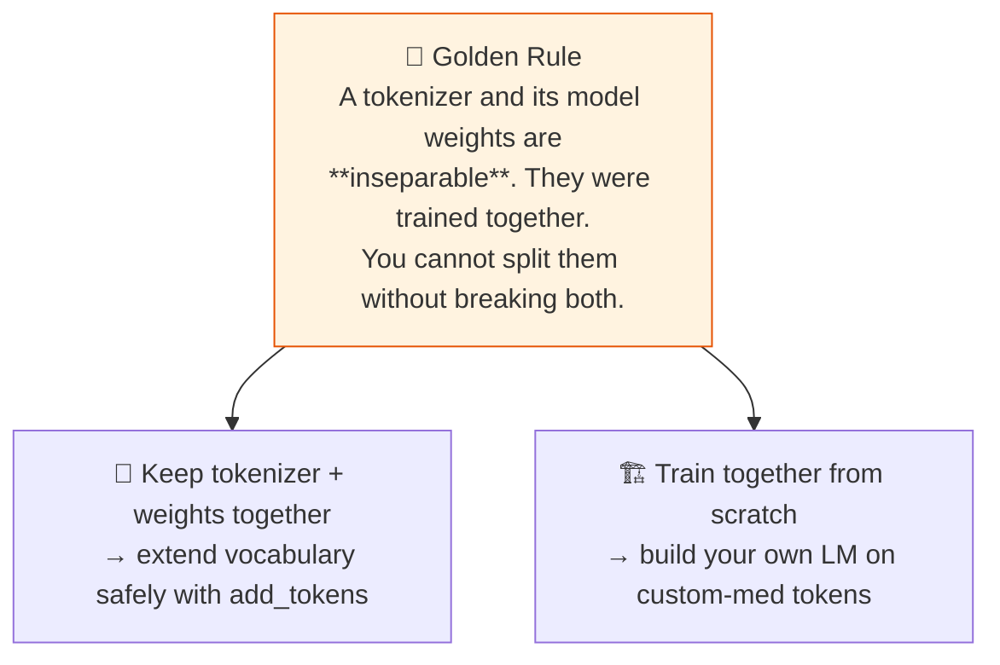

# ⚠️ The Pretrained-Model Trap

> **"I'll just swap in my custom tokenizer on Qwen/LLaMA and do LoRA."**
> This sounds reasonable. It is catastrophically wrong.

This page is the visual version of the most important warning in the lab.

The short version is simple: a pretrained tokenizer and a pretrained model were learned together. If you replace one but keep the other, the mapping between token IDs and embedding rows breaks.

## The core mismatch

Read this first diagram as a mismatch between two tables:

- the tokenizer decides which integer ID each string gets
- the model's embedding matrix decides what each integer ID means

If those two tables were built together, everything is aligned.
If you swap only the tokenizer, the same integer IDs now point to the wrong meanings.

In plain language: the model is not confused because the new tokenizer is medical. It is confused because token ID 4521 no longer means the same thing to the tokenizer and the model.

## Two valid paths, one fatal path

This second diagram is about choices.

It shows one unsafe path and two safe ones:

- unsafe: replace the tokenizer of a pretrained model
- safe: keep the pretrained tokenizer and extend it carefully
- safe: train a new model from scratch with the custom tokenizer

That is the decision rule this page wants to teach: if the model already exists, keep its tokenizer unless you are doing a controlled vocabulary extension.

## Why the alignment matters: a concrete example

This example makes the mismatch less abstract.

Before the swap, token ID 7821 and embedding row 7821 refer to the same concept.

After the swap, token ID 7821 may now mean `empagliflozin`, but embedding row 7821 still contains the meaning learned for some older Qwen token.

So the model starts with the wrong input representation before attention even begins.

That is why LoRA is not enough. LoRA can adapt behavior, but it does not automatically rebuild the full vocabulary-to-embedding alignment from scratch.

## The golden rule

This final diagram gives the memory rule for the whole topic.

If you remember only one sentence from this page, remember this one: tokenizer IDs and embedding rows must stay aligned.

> **This lab** focuses on tokenizers, not LM training. But understanding this trap helps you see
> why the tokenizer step is not just a preprocessing detail — it **determines what model you can use**.

In plain language: better tokenization alone does not give you permission to plug that tokenizer into any pretrained model.

---
*Back to theory: [06 pretrained model trap](../theory/06-pretrained-model-trap.md)*
