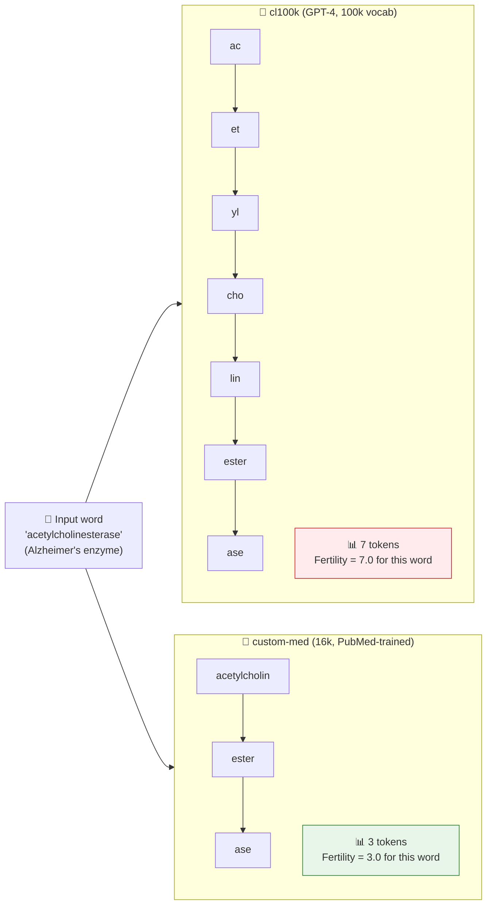
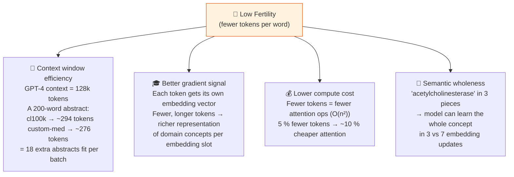
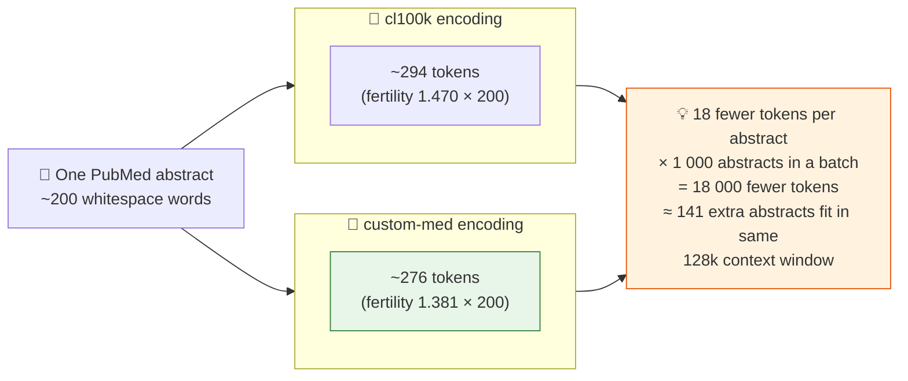

# 🌱 Fertility: Why Fewer Tokens Per Word Wins

> **Fertility** = average tokens per whitespace word.  
> Lower is better. A tokenizer that splits `acetylcholinesterase` into 2 pieces knows medicine.
> One that splits it into 8 is wasting context window and gradient signal.

This page explains the main metric used in the lab.

If you want the simplest version, fertility answers one question:

**How many token pieces does the tokenizer need, on average, to represent the same text?**

Lower fertility means denser tokenization. Higher fertility means more fragmentation.

## What happens to one clinical term

Start with the single-word example below.

It shows the same medical term going through two tokenizers. One tokenizer breaks it into many small pieces. The other keeps it in fewer, larger pieces.

That difference is exactly what fertility is trying to measure at scale.

In plain language: fewer pieces means the tokenizer has already done more of the grouping work before the model sees the word.

## Why low fertility matters

The next diagram answers the obvious follow-up question: why should anyone care about a difference like 3 pieces versus 7 pieces?

The answer is that token count affects both efficiency and representation quality.

So fertility is not just a cosmetic metric. It affects how much text fits in context, how much compute the model spends, and how fragmented important medical concepts become.

## The actual numbers from this lab

The table below moves from one word to the full held-out dataset.

This is important because the lab's claim is not based on a few hand-picked examples. It is based on average behavior over many unseen medical abstracts.

**Medical held-out set** (`pubmed_heldout.jsonl` — 5 000 abstracts, lower = better)

| Rank | Tokenizer | Fertility | Notes |
|------|-----------|-----------|-------|
| 🥇 1 | 🏥 **custom-med** (16k) | **1.381** | Domain training wins |
| 🥈 2 | 🤖 o200k (200k) | 1.439 | 12× bigger vocab, still loses |
| 🥉 3 | 🤖 cl100k (100k) | 1.470 | 6× bigger vocab, still loses |
| 4 | 📰 general-bpe (16k) | 1.759 | Same size as custom-med — domain is the secret |

> 🏆 `custom-med` wins with fertility **1.381**  
> Even `cl100k` (6× bigger vocab) loses — at **1.470**  
> `general-bpe` (same 16k size) is worst at **1.759** — vocab size isn't the secret, **domain is**

That is the key reading rule: lower fertility on held-out medical text means the tokenizer is representing medical language more efficiently.

## The flip side — general text

This second table is just as important as the first one.

If `custom-med` also won on general English, it would be harder to argue that it truly specialized for medicine. Losing on general text is the honest sign that its vocabulary budget was spent on medical patterns.

**General held-out set** (`general_heldout.jsonl` — 5 000 wikitext paragraphs, lower = better)

| Rank | Tokenizer | Fertility | Notes |
|------|-----------|-----------|-------|
| 🥇 1 | 🤖 o200k (200k) | **1.401** | Web-scale vocab wins on web text |
| 🥈 2 | 🤖 cl100k (100k) | 1.434 | Strong general baseline |
| 🥉 3 | 📰 general-bpe (16k) | 1.503 | Small but general-trained |
| 4 | 🏥 **custom-med** (16k) | 1.812 | Specialised vocab — expected to lose here |

> 🔄 `custom-med` **loses** on general text (1.812 — worst!)  
> This is expected and healthy — it specialised its 16k budget on medical morphemes  
> A student who notices this flip has understood domain specialisation

In plain language: a domain tokenizer is not supposed to win everywhere. It is supposed to win where its domain gives it an advantage.

## Fertility over a full abstract

This last diagram turns the metric into something more concrete.

Instead of looking at one word, it asks: what happens over an entire abstract?

Small differences in fertility per word become much larger differences when you multiply them across hundreds or thousands of documents.

That is why fertility matters in practice. A small improvement per word can turn into meaningful savings in context usage and compute over a real dataset.

---

## Glossary at a glance

| Term | Formula | What it tells you |
|------|---------|------------------|
| **Fertility** | tokens ÷ whitespace words | Avg pieces per word (lower = more efficient) |
| **Chars/token** | characters ÷ tokens | Avg characters per token (higher = denser) |
| **Single-token rate** | fraction of terms = 1 token | Vocab coverage of domain jargon |

If you only remember one thing from this page, remember this: **lower fertility means the tokenizer needs fewer pieces to express the same text.**

---
*Back to theory: [01 why tokenization matters](../theory/01-why-tokenization-matters.md) · [04 metrics](../theory/04-metrics.md)*
