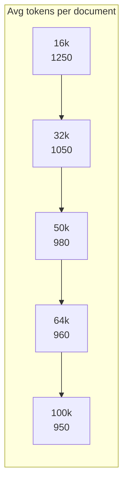
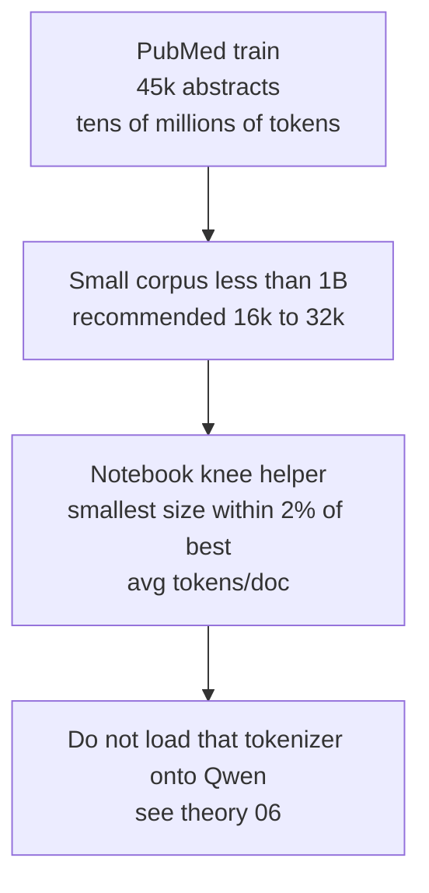

# Vocab-size knee: compression vs embedding cost

> Companion to [08 — vocab size trade-off](../theory/08-vocab-size-tradeoff.md).
> Avg tokens/doc falls fast, then flattens. Embedding params keep climbing.

This page explains the idea of the **knee** in the vocabulary-size curve.

The basic question is simple:

**How large should the tokenizer vocabulary be before extra size stops helping much?**

The answer is usually not “as large as possible.” The best choice is often near the point where compression improves more and more slowly.

## Diminishing returns (lesson numbers)

Large-corpus **worked example**. PubMed numbers in the notebook will sit left of this knee.

Read this first example from left to right:

- as vocabulary size grows, token count goes down
- but the improvement gets smaller at each step
- eventually the curve starts to flatten



```text
16k   ████████████████████████████████████  1250
32k   ██████████████████████████████        1050   −16%
50k   ████████████████████████████          980    −7%
64k   ███████████████████████████           960    −2%
100k  ███████████████████████████           950    −1%   ← stop
```

64k → 100k saves ~1% of tokens. Rule of thumb: pick **64k** on that corpus.

That flattening point is the knee. Before the knee, increasing vocab size buys meaningful compression. After the knee, it mostly buys extra parameters.

## Embedding table still grows

The second part of the trade-off is model size.

Every new vocabulary entry needs an embedding row, and usually also contributes to the output layer. So vocabulary growth is not free.

```text
params ≈ vocab × d_model   (d_model = 1024)

16k    ████                 16.4M   1.00×
32k    ████████             32.8M   2.00×
50k    ████████████         51.2M   3.12×
64k    ████████████████     65.5M   4.00×
100k   ████████████████████ 102.4M  6.25×
```

After the knee you pay 6× the embedding rows for almost no shorter sequences.

In plain language: once the compression gains become tiny, a larger vocabulary starts to look expensive rather than helpful.

## This lab's corpus band

This final diagram applies the idea to the actual lab.

The PubMed corpus in this repo is much smaller than the giant corpora used for modern foundation models. That means the best vocabulary size should usually be smaller too.



50k as a "modern LLM sweet spot" assumes 1B–100B+ pretraining tokens. Not 45k abstracts.

So the main takeaway is:

- large production models often justify larger vocabularies
- small domain corpora often reach the knee much earlier
- for this lab, 16k to 32k is the expected useful band

If you only remember one rule from this page, remember this: **pick the smallest vocabulary that gets you close to the best compression result.**
